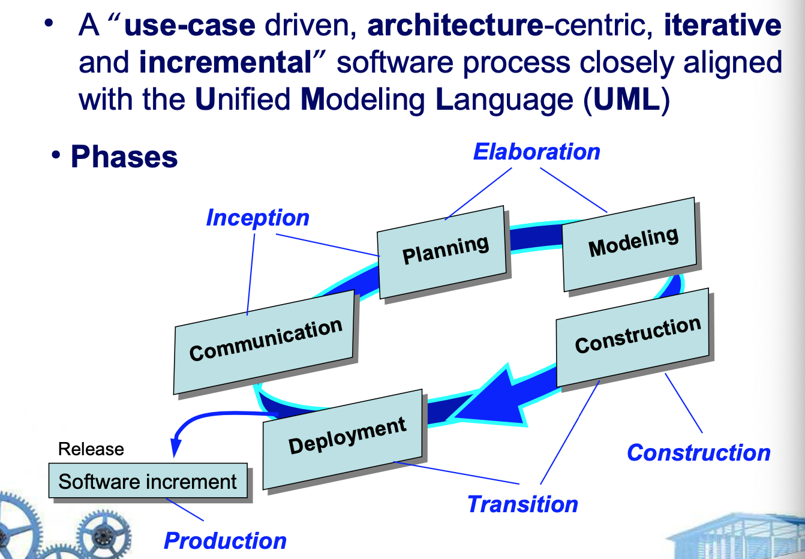
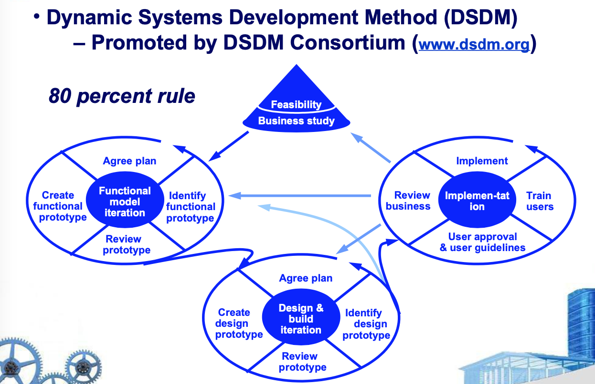
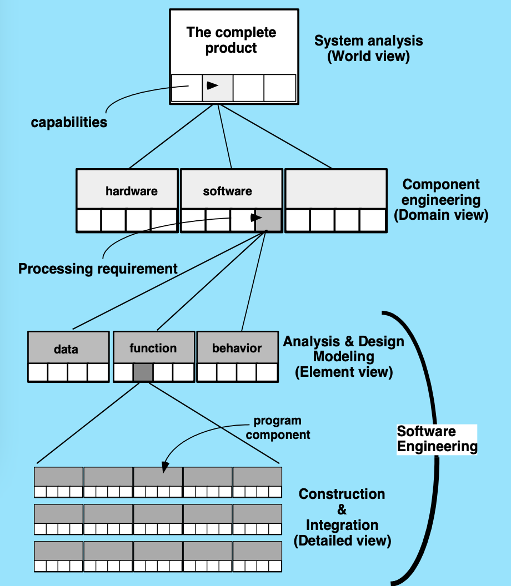

# Zhejiang University

## software engineering course

Zhejiang University software engineering course

# Chapter 1 
## Background

### The Evolving Role of Software

In the early days: User <--> Computer

  **SoftWare** = "Place a sequence of instructions together to get the computer to do something useful"

In late 1950's: User <- -> **Programmer** <- -> Computer

  Computer bacame cheaper and more common.
  
  High level languages were invented.

In early 1960's: Hacker != Cracker

  Very few large software projects were done by some experts.

### Case

美国IBM公司1963年到1966年开发的IBM360机的操作系统。这以项目花了5000人-年的工作量，最多时有1000人投入开发工作，写出了近100万行源程序。据统计，这个操作系统每次发行的新版本都是从前一版本中找出1000个程序错误而休整的结果。

这个项目负责人是够总结了在组织开发过程中的沉痛教训时说：”正像一只逃亡的野兽落到泥沼中做垂死挣扎，越是挣扎，陷得越深，最后无法逃脱灭顶的灾难“

IBM360操作系统的历史教训成为软件开发项目的典型事例为人们所记取，从而有《人月神话》这本书，至今畅销不衰

## Software Aplication Types
* System software
* Application software
* Engineering/Scientific software
* Embedded software
* Product-line software
* Web-applications
* Artificial intelligence software

## Legacy Software - Why must it change?
* software must be adapted to meet the needs of new computing environments or technology.
* software must be enhanced to implement new business requirements.
* software must be extended to make it interoperable with other more modern systems or databases.
* software must be re-architected to make it viable within a network environment.

# Chapter 2
## A Generic View of Process

### A Process Framework
- Generic Process Framework
  - 1. Communication(customer collaboration and requirement gathering)
  - 2. Planning(establishes engineering work plan, describes technical risks,lists resource requirements, work products produced, and defines work schedule)
  - 3. Modeling(creation of models to help developers and customers unsderstand the requires and software design)
  - 4. Construction(code generation and testing)
  - 5. Deployment(software delivered for customer evaluation and feedback)

### The Capability Maturity Model Integration

-- by Software Engineering Institute(SEI) of Carnegie Mellon University(CMU)

* Level 0: Incomplete (process is not performed or does not achieve all goals defined for this level)
* Level 1:Performed (work tasks required to produce required work products are being conducted)
* Level 2:Managed(people doing work have access to adequate resources to get job done, stakeholders are actively involved,work tasks and products are monitored,reviewed, and evaluated for conformance to process description)
* Level 3: Defined(management and engineering processes documented,standardized,and integrated into origanization-wide software process)
* Level 4:Quantitatively Managed(software process and products are quantitatively understood and controlled using detailed measures)
* Level 5:Optimizing(continuous process improvement is enabled by quantitative feedback from the process and testing innovative ideas)

这就是评价软件等级的标准，对于目前公司里面的等级大多数我觉得都是Level 3 - Level4

### Personal and Team Process Models
Personal Software Process(PSP)

- Recommends five freamework activities:
  - 1. Planning
  - 2. High-level design
  - 3. High-level desing review
  - 4. Development
  - 5. Postmortem
- Stresses the need for each software engineer to identify errors early and as important, to understand the types of errors

# Chapter 3

## Process Models

### Waterfall Model
- 1. Communication
  - Project initiation
  - Requirements gathering
- 2. Planning
  - Estimating
  - Scheduling and tracking
- 3. Modeling
  - Analysis and design
- 4. Construction
  - Code and test
- 5. Deployment
  - Delivery
  - Support and feedback

### Incremental Process Models

### Evolutionary Process Models

### Specialized Process Models
- Component based development -- the process to apply when reuse is a development objective
- Formal methods - emphasizes the mathematical specification of requirements
- Aspect-Oriented Software Development - provides a process and methodological approach for defining, specifying,desiging, and constructing aspects

### The Unified Process

### Process flow

# Chapter 4

## An Agile View of Process

### Manifesto for Agile Software Development
- Responding to change
- Customer collaboration
- Working software
- Individuals and interactions

### Why is Agility?
- Effective(rapid and adaptive) response to change
- Effective communication among all stakeholders
- Drawing the customer onto the team
- Organizing a team so that it is in control of the work performed 
- Rapid,incremental delivery of software
- The 12 principles for achieving agility

### What is an Agile Process
- Is driven by customer descriptions of what is required(scenarios)
- Recognizes that plans are short-lived
- Develops software iteratively with a heavy emphasis on construction activities
- Delivers multiple "software increments"
- Adapts as changes occur

### Agile Process Models

Agile Modeling(AM)-by Scott Ambler
- Modeling principles
  - Model with a purpose
  - Use multiple models
  - Travel light(only keep models with long-term value)
  - Content is more important than representation
  - Know the models and tols you use to create them
  - Adapt locally

# Chapter 5

## Software Engineering Practice

### The Essence of Practice
- Understan the problem(communication and analysis)
- Plan a solution(modeling and software design)
- Carry out the plan(code generation)
- Examine the result for accuracy(testing and quality assurance)

### Core Priciples
- Provide value to the customer and the user
- KISS -- Keep It Simple, Stupid!
- Maintain the product and project "vision"
- Waht you produce,others will consume
- Be open to the future
- Plan ahead for reuse
- Think!

### other 
- Communication Pratices
- Planning Practices
- Modeling Practices
  - Analysis
  - Design
- Construction Practices
  - Coding
  - Testing
- Deployment

# Chapter 6

## System Engineering

### The System Engineering Hierarchy

### Business Process Engineering

Goal: define architecture that will enable a business to use information effectively

Architectures to be analyzed and designed within the context of business objectives and goals:
- data architecture provides a framework for the information needs of business or business function
- application architecture encompasses those elements of a system that transform objects within the data architecture for some business purpose
- technology infrastructure provides the foundation for the data and application architectures

### Product Engineering

Goal: translate the customer's desire for a set of defined capabilities into a working product 

### System Modeling

### Architecture Flow Diagram

# Chapter 7

## Principles that Guide Practice

[pdf](./resource/ModelingPrinciples.pdf)

# Chapter 8

## Understanding Requirements

[pdf](./resource/UnderstandingRequiremen.pdf)

# 总结

浙江大学软件工程课程在工作多年之后回头再来看，确实很多实际的方法论在大学课程中就能很明显的体现出来，只是作为学生在课堂上听讲，没有实际的工作磨砺，并不能体会其中内容的精辟和实用。

作为一门非常经典的课程，暂时只写了8章的内容，等后面再慢慢补充，其中软件测试，项目管理都是属于软件工程里面涵盖的内容，也有很多经典的策略和方法论，后续再更新。

这门课程也是可以反复不断地琢磨和学习的，毕竟太阳底下无新鲜事也适用于当前的软件行业。
